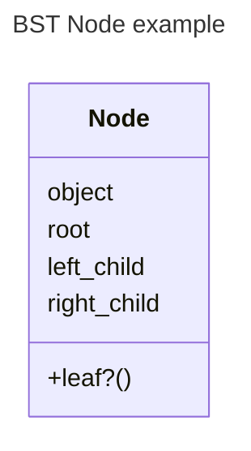
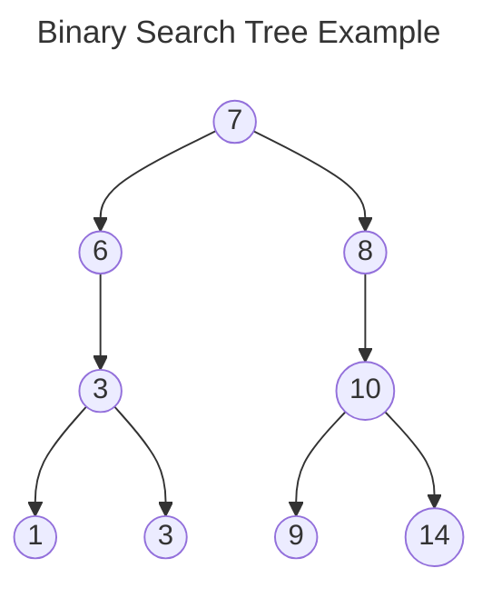
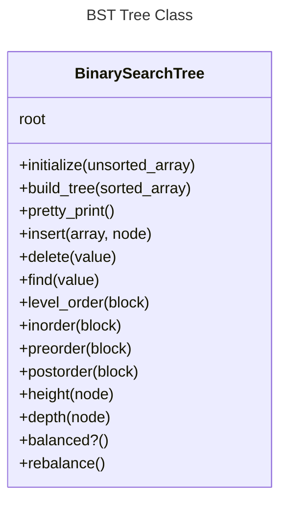

# Binary Search Tree Algorithm

## Assignment:

You’ll build a balanced BST in this assignment. Do not use duplicate values because they make it more complicated and result in trees that are much harder to balance. Therefore, be sure to always remove duplicate values or check for an existing value before inserting.

1. Build a Node class. It should have an attribute for the data it stores as well as its left and right children. As a bonus, try including the Comparable module and compare nodes using their data attribute.

2. Build a Tree class which accepts an array when initialized. The Tree class should have a root attribute which uses the return value of #build_tree which you’ll write next.

3. Write a #build_tree method which takes an array of data (e.g. [1, 7, 4, 23, 8, 9, 4, 3, 5, 7, 9, 67, 6345, 324]) and turns it into a balanced binary tree full of Node objects appropriately placed (don’t forget to sort and remove duplicates!). The #build_tree method should return the level-0 root node.

Tip: If you would like to visualize your binary search tree, here is a #pretty_print method that a student wrote and shared on Discord:

```ruby
def pretty_print(node = @root, prefix = '', is_left = true)
  pretty_print(node.right, "#{prefix}#{is_left ? '│   ' : '    '}", false) if node.right
  puts "#{prefix}#{is_left ? '└── ' : '┌── '}#{node.data}"
  pretty_print(node.left, "#{prefix}#{is_left ? '    ' : '│   '}", true) if node.left
end
```

4. Write an #insert and #delete method which accepts a value to insert/delete (you’ll have to deal with several cases for delete such as when a node has children or not). If you need additional resources, check out these two articles on inserting and deleting, or this video with several visual examples.

You may be tempted to implement these methods using the original input array, but it’s important for the efficiency of these operations that you don’t do this. If we refer back to the Big O Cheatsheet, we’ll see that binary search trees can insert/delete in O(log n) time, which is a significant performance boost over arrays for the same operations. In order to get this added efficiency, your implementation of these methods should traverse the tree and manipulate the nodes and their connections.

5. Write a #find method which accepts a value and returns the node with the given value.

6. Write a #level_order method which accepts a block. This method should traverse the tree in breadth-first level order and yield each node to the provided block. This method can be implemented using either iteration or recursion (try implementing both!). The method should return an array of values if no block is given. Tip: You will want to use an array acting as a queue to keep track of all the child nodes that you have yet to traverse and to add new ones to the list (as you saw in the video).

7. Write #inorder, #preorder, and #postorder methods that accepts a block. Each method should traverse the tree in their respective depth-first order and yield each node to the provided block. The methods should return an array of values if no block is given.

8. Write a #height method which accepts a node and returns its height. Height is defined as the number of edges in longest path from a given node to a leaf node.

9. Write a #depth method which accepts a node and returns its depth. Depth is defined as the number of edges in path from a given node to the tree’s root node.

10. Write a #balanced? method which checks if the tree is balanced. A balanced tree is one where the difference between heights of left subtree and right subtree of every node is not more than 1.

11. Write a #rebalance method which rebalances an unbalanced tree. Tip: You’ll want to use a traversal method to provide a new array to the #build_tree method.

## Tie it all together

### Write a simple driver script that does the following:

1. Create a binary search tree from an array of random numbers (Array.new(15) { rand(1..100) })
2. Confirm that the tree is balanced by calling #balanced?
3. Print out all elements in level, pre, post, and in order
4. Unbalance the tree by adding several numbers > 100
5. Confirm that the tree is unbalanced by calling #balanced?
6. Balance the tree by calling #rebalance
7. Confirm that the tree is balanced by calling #balanced?
8. Print out all elements in level, pre, post, and in order


# Pseudocode

## Node structure

The node structure should store four data points:




A binary search tree (BST) node is similar to a node in a linked list - it holds the value of its own data and pointers to elements of the tree it is directly connected to.  The `root` of a node is the parent node that comes directly before it in the BST.  If the `root` is `nil`, that indicates that the node is currently the root of the tree itself.  This node should be stored in the BST Class as the `root` of that particular tree.  Because BST is similar both to a Binary Sort method and a Linked List, we use the ideas of `left_child` and `right_child` to indicate values that are less-than and greater-than the current node's data value respectively. 

## Tree structure

A binary search tree is a data structure such that: Every node has a root node (the node that comes before it in the tree) and 0, 1, or 2 children nodes.  The children nodes are ordered such that the left node's value will be less than the value of the current node while the right node's value will be greater than the value of the current node's value. If a node doesn't have any children, it is considered a leaf node.

Given the values:
`[1,3,4,6,7,8,9,10,14]`



### Initializa

Upon initialization of a new BST - `bst = BinarySearchTree.new(unsorted_array)`, we set root as the value of our `#build_tree` method by calling:

```ruby
def initialize(array)
  @root = build_tree(array.sort.uniq)
end
```

### Root
The root of our binary tree will always be the midpoint of the array that is passed on initialization.  We don't want to deal with duplicate keys so we must ensure that each key in the array is unique.  It must also be sorted so that we can insert nodes in their proper positioning within the tree structure.

### #build_tree(array)
`#build_tree` takes a sorted, unique array of data as an argument and turns it into a balanced binary tree full of `Node` objects appropriately placed. Our guard clause ensures that we're not passing in an empty array to build out.  

When `build_tree` is called, there are no nodes currently in existance so we have to create a node with the data we have in our array.  To do that, we call `#build_root` and pass it the value of `array`. Once we have the return value of `build_root`, we call `#insert_node` with `array` and `node` as arguments.  Finally, we return node.

```ruby
def build_tree(array)
  return nil if array.empty?
  node = build_root(array)
  insert_node(array, node)
  return node
end
```

### #pretty_print()
`#pretty_print` provides a method to visualize the binary search tree.  This method is not orginal to me, but was provided in the lesson on [TOP](https://theodinproject.com) as coming from another student of the course.

```ruby
def pretty_print(node = @root, prefix = '', is_left = true)
  pretty_print(node.right_child, "#{prefix}#{is_left ? '│   ' : '    '}", false) if node.right_child
  puts "#{prefix}#{is_left ? '└── ' : '┌── '}#{node.data}"
  pretty_print(node.left_child, "#{prefix}#{is_left ? '    ' : '│   '}", true) if node.left_child
end
```
### #insert_node(array, node)

[//]: # TODO: Clean this section up, it's not ready for prime time.

`#insert(value)` provides a method for inserting a node with 'value' as its `data` into the tree. We are carrying our value through the recursion and use a directional switch named `direction` to determine the direction of traversal.  
- First, we test our node - if it's nil, create a node and set it to the the root node.  
- We first use a comparator (spaceship operator) to glean the relationship of `value` to the current `node.data` (less than: -1, equal to: 0, greater than: 1) and store the result in `direction`.  
- Next we test to see if there are no children in the current node.  
- If there are no children we use a pattern match to determine which child 


### #delete(value)

### #find(value)

### #level_order(block)

### #inorder(block)

### #preorder(block)

### #postorder(block)

### #height(node)

### #depth(node)

### #balanced?()

### #rebalance()
